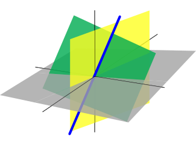

# lmatrix



*A Simple Linear Algebra Library for LFE*


## Introduction

Erlang is not a programming language designed for nor performant with
numerical calculations. This library is for fun only, not for scientific
computing purposes.


## Installation

Just add it to your ``rebar.config`` deps:

```erlang
    {deps, [
        ...
        {lmatrix, ".*", {git, "git@github.com:YOURNAME/lmatrix.git", "master"}}
      ]}.
```

And then do the usual:

```bash
    $ rebar get-deps
    $ rebar compile
```


## Usage

Add content to me here!
